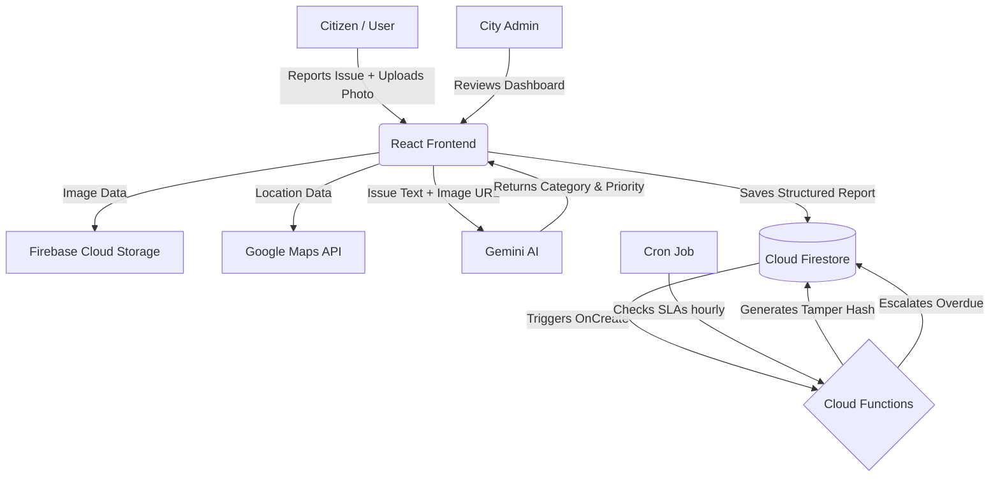
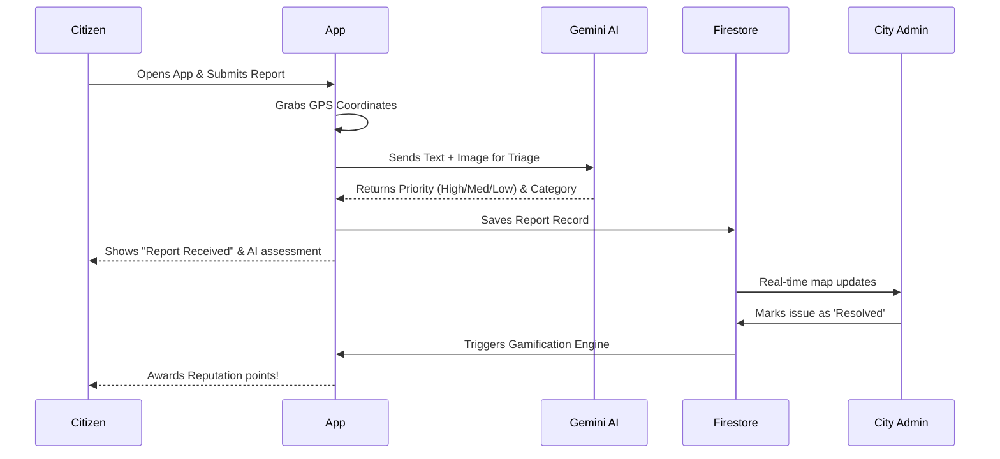

# 🏙️ SmartCity

**AI-powered civic issue reporting and resolution platform.**

SmartCity is a hyper-local problem-solving platform designed for the **Vibe2Ship Hackathon**. It empowers citizens to report civic issues (like potholes, broken streetlights, or illegal dumping) and uses advanced AI to automatically categorize, prioritize, and route them to the correct authorities.

---

## 🌟 Key Features

- **AI Triage System**: Automatically classifies the severity and category of issues using **Google Gemini AI**.
- **Real-Time Location Tracking**: Pinpoints issues precisely on a live interactive map via **Google Maps API**.
- **Automated SLA Monitoring**: Cloud Functions enforce Service Level Agreements, automatically escalating overdue issues.
- **Secure Image Uploads**: Citizens can attach photo evidence, which is processed and stored securely.
- **Gamification**: Citizens earn reputation scores and badges (e.g., *First Blood*, *Eagle Eye*) for verified reports.

---

## 🚀 Google Technologies Under the Hood

SmartCity is proudly built on Google's world-class infrastructure to ensure scalability, intelligence, and security.

1. **Google AI Studio (Gemini)**: The brain of the application. Gemini 1.5 Flash processes issue descriptions and image evidence to assign categories and determine priority levels.
2. **Google Maps Platform**: Used for geo-tagging, map visualization, and location clustering.
3. **Firebase Authentication**: Handles secure citizen and admin logins.
4. **Cloud Firestore**: A NoSQL document database storing all reports, user data, and notifications in real time.
5. **Firebase Cloud Storage**: Securely stores all photographic evidence.
6. **Firebase Cloud Functions**: Serverless Node.js backend handling automated SLA cron jobs, data tamper hashing, and gamification rewards.
7. **Firebase Hosting**: Serves the blazingly fast React frontend globally via CDN.

---

## 🗺️ How It Works (Architecture)



## 🔄 User Journey Flow



## 🛠️ Setup & Local Development

1. Clone the repository:
   ```bash
   git clone https://github.com/kotreshsk/SmartCity.git
   cd SmartCity
   ```
2. Install dependencies:
   ```bash
   npm install
   ```
3. Set up `.env` with your Firebase and Google Maps keys.
4. Run locally:
   ```bash
   npm run dev
   ```

---
*Built with ❤️ for Vibe2Ship.*
